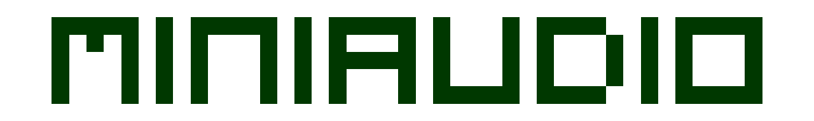
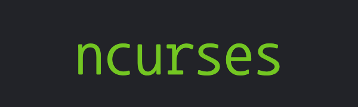
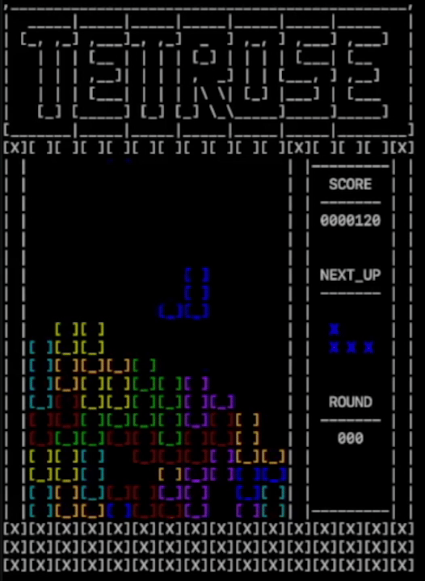
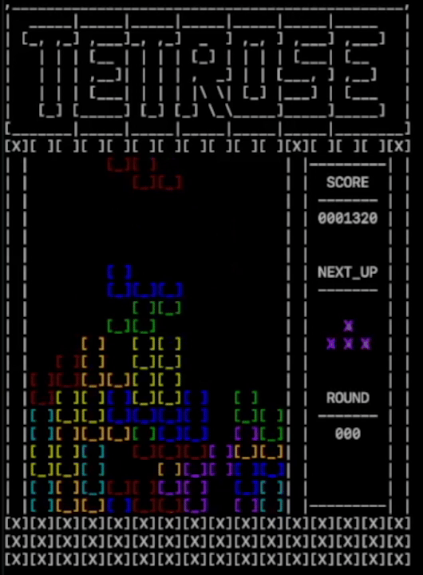

# MacOS Terminal Falling Block Game
A colorful ASCII art falling block game that runs directly in the macOS terminal.

## **About the Project**
---
This program is my attempt at creating a falling block game within the MacOS terminal. There are still plenty of things I would like to improve, but this version is ready to share! I used ncurses to handle user input and program output, and miniaudio to handle the game's sound. Everything else is native to c++. 
<br><br>

<!-- put icons of language usage here and links to the libraries used. basically the tech stack-->
<div style="display: flex; justify-content: space-between;">
  <div></div>
  <div></div>
  <div></div>
  <div></div>
</div><br>


## **Features**
---
+ runs in color within the terminal!
+ sound effects for row clears and tetromino landing
+ Korobeiniki melody background music
+ player points, round count, and next tetromino are all displayed during gameplay
+ hand-typed ascii art is used for the entire game

<br>


<br><br>

## **Requirements and Build**
---
**This project was only programmed to run on macOS.** It uses system libraries that aren't on other operating systems.

The only requirement that this project has is ncurses (miniaudio is included in the source code), and it can be downloaded with Homebrew. If Homebrew isn't installed, you can do it with this command:

```
/bin/bash -c "$(curl -fsSL https://raw.githubusercontent.com/Homebrew/install/HEAD/install.sh)"
```

After Homebrew is installed, ncurses can be installed with the following command:

```
brew install ncurses
```

Once you've done those two things, all you have to do is run the makefile and the executable:

```
cd src
make tetrose
./tetrose
```

<br>

## **How to Play**
---
| Key               | Action                             |
|-------------------|------------------------------------|
| Ctrl + C          | Quits the program                  |
| Q                 | Ends the game                      |
| A                 | Rotates the tetromino to the left  |
| D                 | Rotates the tetromino to the right |
| S                 | Drops the tetromino immediately    |
| Left Arrow        | Moves the tetromino to the left    |
| Right Arrow       | Moves the tetromino to the right   |
| Down Arrow        | Moves the tetromino downwards      |
<br>

## **Sound Effect and Theme Credits**
---
small_crash.mp3 - Driken5482 https://pixabay.com/users/driken5482-45721595/

big_crash.mp3 - freesound_community https://pixabay.com/users/freesound_community-46691455/

theme.mp3 - jkotas1 https://archive.org/details/@jkotas1

tetrose.mp3 - RasoolAsaad https://pixabay.com/users/rasoolasaad-47313572/

level_up.mp3 - mattwasser https://pixabay.com/sound-effects/coin-upaif-14631/
